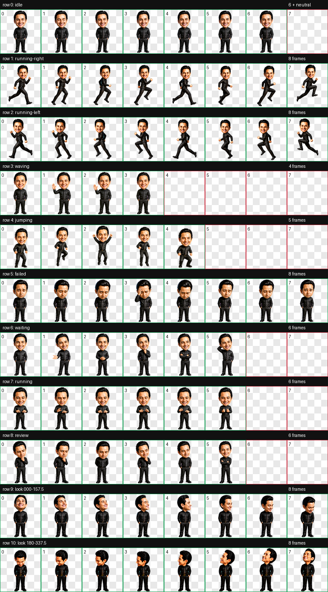
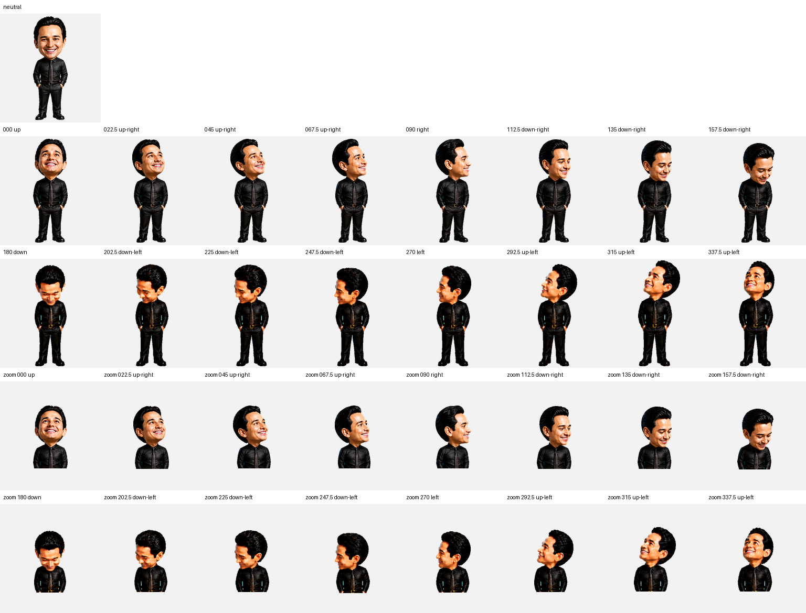
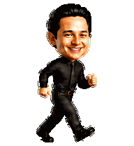

# Joe Simo Pet

Premium-polished example Codex pet package for Joseph Simo.

Use this as an example package, or copy the prompt below to ask Codex to make a custom pet from your own face or picture.

This repository is intentionally small and public-safe. It contains only the pet package, preview images, and validation artifacts. It does not include the `joesimo` personal website project, source website files, API code, credentials, or private source portraits.

## Copy-Paste Prompt

Paste this into Codex and attach a clear picture of your face, pet, mascot, or character:

```text
Use the hatch-pet skill to make my own Codex pet from my attached picture.

Use my picture as the identity source, not Joe Simo's pet. Preserve the recognizable face, silhouette, colors, expression, and personality from my picture, but simplify it into a compact animated Codex pet that reads clearly at small size.

Pet name: <my pet name>
Style: auto, based on my picture
Install location: ~/.codex/pets/<safe-pet-id>

Create a complete Codex-compatible v2 pet package with:
- pet.json
- spritesheet.webp
- spriteVersionNumber: 2
- an 8-column x 11-row atlas with 192x208 cells
- all required animation states: idle, running-right, running-left, waving, jumping, failed, waiting, running, review
- all 16 clockwise look directions in 22.5-degree steps, starting at 000 up
- contact sheet, look-direction sheet, and animated previews for visual QA
- validation results for atlas size, transparency, chroma cleanup, unused cells, duplicate frames, frame readability, direction semantics, and adjacent-direction continuity
- a blind direction review that confirms every horizontal and vertical landmark with no unresolved directions

Keep it public-safe. Do not include my original picture, private files, credentials, API keys, or unrelated project files in the final package or any repository.
```

## Contents

- `pet/pet.json` - Codex pet metadata.
- `pet/spritesheet.webp` - Codex-compatible animated pet atlas.
- `preview/` - current contact sheet, direction sheet, and nine animated QA previews.
- `checks/` - deterministic validation, direction, motion, integrity, and final visual-QA evidence.

## Pet Specs

- Pet contract: `spriteVersionNumber: 2`
- Atlas size: `1536x2288` (`8x11` cells)
- Cell size: `192x208`
- Animation states: `idle`, `running-right`, `running-left`, `waving`, `jumping`, `failed`, `waiting`, `running`, `review`
- Look directions: `16` clockwise poses in `22.5`-degree steps from `000` up through `337.5` up-left
- Final installed SHA-256: `6aa5f2800c7e3752c9c7b958cdae749d1049d607bf9c8afc584e247a93796da0`

## Preview





### Directional Run Cycles




## Install Joe's Example Pet

Paste this into a terminal to install the pet without cloning the repo:

```sh
PET_DIR="$HOME/.codex/pets/simo-real"
mkdir -p "$PET_DIR"
curl -fsSL "https://raw.githubusercontent.com/Joe-Simo/joe-simo-pet/main/pet/pet.json" -o "$PET_DIR/pet.json"
curl -fsSL "https://raw.githubusercontent.com/Joe-Simo/joe-simo-pet/main/pet/spritesheet.webp" -o "$PET_DIR/spritesheet.webp"
echo "Installed Joe Simo Pet at $PET_DIR"
```

Restart Codex if it was already open.

## Manual Install

If you cloned this repository, install it with:

```sh
mkdir -p "$HOME/.codex/pets/simo-real"
cp pet/pet.json "$HOME/.codex/pets/simo-real/pet.json"
cp pet/spritesheet.webp "$HOME/.codex/pets/simo-real/spritesheet.webp"
```

## Custom Pet Prompt With Image Path

If your picture is already saved locally, paste this into Codex and replace the image path:

```text
Use the hatch-pet skill to make my own Codex pet from my picture.

Picture: <attach my image here, or use /absolute/path/to/my-picture.png>
Pet name: <my pet name>
Style: auto. Preserve the recognizable face, silhouette, colors, and personality from the picture, but make it readable as a small animated Codex pet.

Use my picture as the identity source, not Joe Simo's pet.

Create a complete Codex-compatible v2 pet package with:
- pet.json
- spritesheet.webp
- spriteVersionNumber: 2
- an 8-column x 11-row atlas with 192x208 cells
- all required animation states: idle, running-right, running-left, waving, jumping, failed, waiting, running, review
- all 16 clockwise look directions in 22.5-degree steps, starting at 000 up
- contact sheet, look-direction sheet, and animated previews for visual QA
- validation results for atlas size, transparency, chroma cleanup, unused cells, duplicate frames, frame readability, direction semantics, and adjacent-direction continuity
- a blind direction review that confirms every horizontal and vertical landmark with no unresolved directions

Install the finished pet locally at:
~/.codex/pets/<safe-pet-id>

Keep it public-safe. Do not put my original private picture, credentials, API keys, or unrelated project files into the final package or repository.
```

## Validation Summary

The final installed package passed:

- `1536x2288` RGBA lossless WebP atlas validation for the `8x11` v2 contract
- `0` transparent RGB residue pixels
- `0` opaque chroma-key pixels and `0` chroma-fringe pixels
- `0` unintended exact duplicate frames; the v2 neutral slot intentionally copies the first idle frame
- `0` nontransparent unused-cell pixels
- `0` large disconnected alpha-component anomalies
- `8/8` running-left frames are exact horizontal mirrors of running-right
- uniform `120 ms` cadence in both directional run loops, with no loop-end hitch
- all `9` animation previews passed frame-count, transparency, state-readability, and loop review
- `16/16` ordered look directions with clean adjacent-direction continuity
- `28/28` blind horizontal and vertical direction checks confirmed by a three-reviewer majority
- `0` deterministic or final visual-QA errors, warnings, or unresolved directions

## License

MIT. See `LICENSE`.
